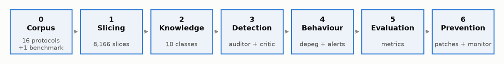
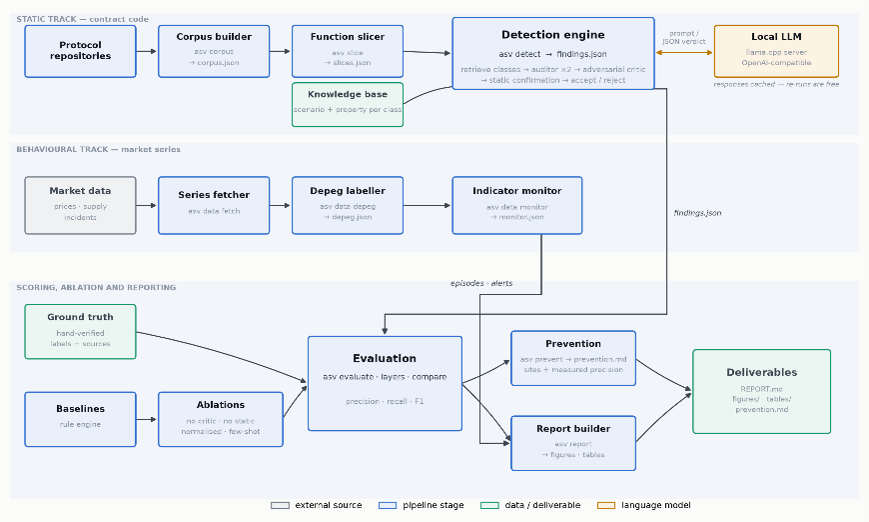

# stablecoin-vuln-llm
LLM-based vulnerability detection for algorithmic stablecoins

Function-level vulnerability detection across 16 algorithmic-stablecoin protocols,
combining a knowledge-base-driven LLM auditor with an adversarial critic and a
static check, plus an independent behavioural track that labels real
depeg episodes from market data.

## The pipeline



The project runs as seven numbered stages, each a single `asv` command writing a
file the next stage reads. **Corpus** clones 16 protocol repositories pinned by
commit and collects their stabilisation logic. **Slicing** cuts that source into
8,166 function-level slices, each carrying its state variables, modifiers and
callee signatures. The **knowledge** defines 10 vulnerability classes,
each as a `scenario` (what the function does) and a `property` (what makes it
vulnerable).

**Detection** is where the model works. A deterministic keyword retriever picks
which classes are worth testing against each slice, producing (slice, class) pairs.
Each pair is audited twice by the LLM at different temperatures, then reviewed by an
adversarial critic whose default position is that the finding is wrong, and
independently checked by a rule engine. A finding is reported only if the
critic accepts it **and** the static check passes.

In parallel, the **behavioural** stage fetches price and supply series for the 12
USD-pegged protocols, labels depeg episodes at three severity thresholds, and runs
an early-warning monitor. **Evaluation** scores the findings against 16
hand-verified ground-truth labels and against rule-based baselines and four
ablations. **Prevention** maps surviving findings to mitigations.

The two tracks never mix: detection metrics come from findings and ground truth
alone, and the behavioural results enter only the report.

## The architecture



## How it works, step by step

**Step 1 — Collect the corpus.** `asv corpus` shallow-clones 16 protocol
repositories at pinned commits into `data/raw/`, keeps only stabilisation-logic
source files (Solidity, Go, Ride), and indexes them into `data/interim/corpus.json`.
SmartBugs-Curated is collected separately as an external comparability track.

**Step 2 — Slice into functions.** `asv slice` cuts every source file into
function-level slices by brace matching, extracting for each one its signature,
compiler version, state variables, modifiers and callee names. Output:
`data/processed/slices.json` — 8,992 slices, of which 8,166 are stablecoin protocol
code and 826 are benchmark contracts.

**Step 3 — Define the vulnerability classes.** `knowledge/vulnerabilities.yaml`
holds 10 classes across four layers (economic, governance, oracle, implementation).
Each carries a scenario, a falsifiable property, retrieval terms, and mechanical
static checks covering Solidity, Go and Ride.

**Step 4 — Sample the slices to audit.** Auditing the full corpus is ~24,500 LLM
calls. `asv detect --limit 200` takes a deterministic stride across the corpus —
proportional to each protocol's share — and unions in all 16 ground-truth functions
so the run stays evaluable. Result: 216 slices.

**Step 5 — Expand slices into (slice, class) pairs.** For each slice the retriever
scores all 10 classes by normalised keyword hit rate and keeps those above zero, up
to four. 216 slices become 423 pairs — the actual unit of analysis.

**Step 6 — Audit each pair with the LLM.** Each pair is rendered into a prompt
carrying the function source, its extracted context, any static-analysis signals and
the class definition. The auditor answers in strict JSON twice, at temperatures 0.3
and 0.7. Nothing in the prompt reveals the ground truth or the static verdict.

**Step 7 — Review, confirm, decide.** Surviving claims go to an adversarial critic
using one of two rubrics chosen by the class's layer. A pure-Python rule engine
checks the class's mechanical conditions independently. A finding is reported only
if both agree; self-contradictory critic replies are recorded as abstentions rather
than resolved. Output: `results/findings.json`.

**Step 8 — Build the behavioural track.** `asv data fetch`, `asv data depeg` and
`asv data monitor` collect free minute- and hour-resolution price series plus daily
supply, label depeg episodes across the 12 USD-pegged protocols, and run an
indicator monitor that raised several early-warning alerts.

**Step 9 — Evaluate.** `asv evaluate`, `asv layers` and `asv compare` score the
findings against the ground truth: per-class and overall precision/recall/F1 and a
comparison against rule baselines and four ablations (no critic, no static veto,
identifier-normalised, few-shot).

**Step 10 — Report.** `asv prevent` maps findings to mitigations and `asv report`
renders every figure and table into `results/`.

## How to run

```bash
python -m pip install -e ".[dev]"
asv corpus && asv slice && asv kb

# start a local model
llama-server -m qwen2.5-coder-7b-instruct-q4_k_m.gguf -c 16384 -ngl 99 \
             --host 127.0.0.1 --port 8080

asv detect --provider local --limit 200
asv data fetch && asv data depeg && asv data monitor
asv baseline --kind static && asv evaluate && asv compare
asv prevent && asv report
```

## License

MIT — see `LICENSE`.
